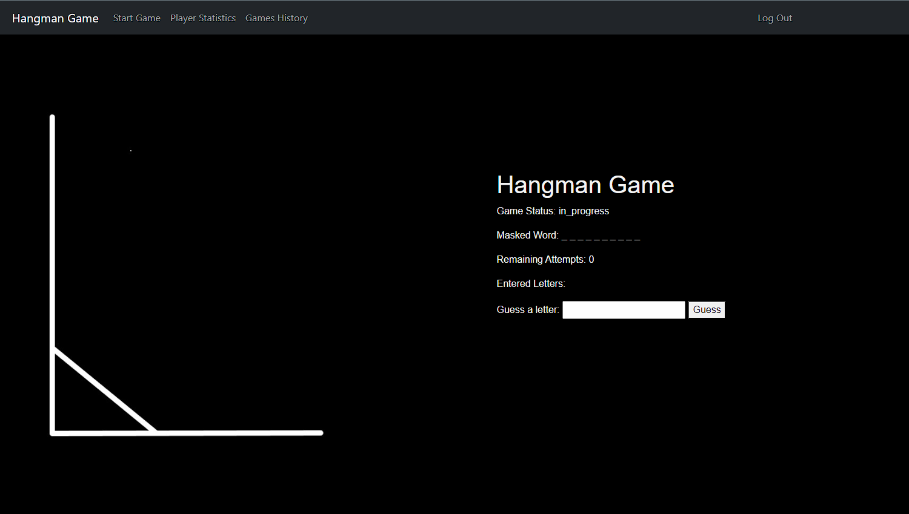

# Hangman Game

Hangman is a simple word guessing game where players attempt to deduce an unknown word by guessing letters. If too many incorrect letters are guessed, the player is "hanged" and loses the game. The goal is to guess the hidden word correctly without using up all the attempts to become the CHAMPION.



## Getting Started

The Hangman app is built using Docker, with the following components:

- Backend: FastAPI
- Frontend: Flask
- Database: PostgreSQL

### Running with Docker

1. Clone the repository:
```
https://github.com/Edv1nas/Hangman_game.git
```

2. Build the Docker image:
```
docker-compose build --no-cache
```

3. Run the Docker image:
```
docker-compose up
```

4. Access the Hangman game website:
```
Game website: http://127.0.0.1:1455/
```


## How to Play

1. Register a new account or log in if you already have one.
2. Select "Start Game" from the top menu bar and press the "Start Game" button to begin.
3. Input letters into the designated field to make guesses.
4. Correctly guessed letters will appear in the hidden word field, incorrect guesses will increase bad attempts.
5. You have a maximum of 10 incorrect attempts. If you exhaust all attempts without guessing the word, you lose. If you successfully guess the word before using all attempts, you win.

### Have Fun and Good Luck!